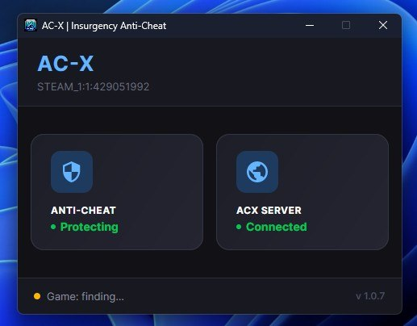

# AC-X — AI-клиент античита для Insurgency 2014

Официальный клиент античита **AC-X** для сообщества Insurgency 2014.  
Помогает серверам поддерживать честную игру: победа и поражение должны зависеть от навыка, а не от запрещённых программ.

> **Это легитимное ПО античита, а не вредоносная программа.**  
> Клиент создан для игроков, которые заходят на серверы с AC-X. Он не крадёт пароли, не майнит криптовалюту и не распространяется скрытно. Исходный код закрыт, чтобы усложнить обход защиты читерами.

## Зачем это нужно?

На защищённых серверах клиент работает вместе с серверной частью AC-X: подтверждает, что вы играете честно, и помогает администрации реагировать на нарушения по правилам сервера.

## Что умеет клиент (для игрока)

- **Автоматические снимки экрана** — в отдельные моменты матча сервер может запросить скриншот. Снимок делается автоматически и проходит проверку (в том числе с помощью ИИ), чтобы отсеять типичные признаки читов и нарушений. На экране видно то, что открыто у вас в этот момент — не оставляйте личные данные и пароли поверх игры.
- **Защита от вмешательства в игру** — клиент отслеживает подозрительную активность вокруг процесса игры (внешнее вмешательство, подозрительные окна и процессы) и сообщает о нарушениях на сервер.
- **Автообновление** — при запуске клиент может скачать новую версию с GitHub Releases, чтобы все игроки были на актуальной защите.
- **Привязка к аккаунту / устройству** — для стабильной идентификации на серверах с AC-X (без сбора лишних личных данных сверх необходимого для античита).

Технические детали детекции намеренно не публикуются: закрытый код снижает шанс обхода со стороны читеров.

## Как пользоваться

1. Скачайте `insurgency_acx.exe` из [Releases](https://github.com/axotk1k1/insurgency-acx/releases) (последняя версия).
2. Запустите клиент **до входа** на сервер с AC-X.
3. Зайдите в Insurgency 2014 на нужный сервер — дальше клиент работает в фоне.

Если Windows SmartScreen или антивирус покажет предупреждение: это бывает у новых неподписанных `.exe`. Убедитесь, что файл скачан **только** с этой страницы Releases, затем разрешите запуск (или добавьте исключение в антивирусе). Мы не распространяем клиент через сторонние зеркала.

## Честность и правила

Правила конкретного сервера и список запрещённого ПО остаются у администрации. AC-X — инструмент поддержки этих правил, а не замена им. Ложные срабатывания возможны; спорные случаи разбирает администрация сервера.

## Вопросы

Группа в Telegram: https://t.me/insurgency2

**Скачать:** [Releases](https://github.com/axotk1k1/insurgency-acx/releases) — выберите последнюю версию и загрузите `insurgency_acx.exe`.

Авторы: @)(otnik & Walson

---

## Notice for GitHub / antivirus vendors (EN)

**Project:** AC-X (`insurgency_acx.exe`) — community anti-cheat **client** for the classic FPS game *Insurgency* (2014).

**Purpose:** Fair-play enforcement on private game servers that opt into AC-X. Players install this client voluntarily to join protected servers.

**What the binary does (high level):**
- Communicates with the server’s AC-X backend over HTTPS
- May capture gameplay screenshots when the server requests them for review
- Monitors for unauthorized interference with the game process while the player is online
- Self-updates from this repository’s GitHub Releases

**What it is not:** ransomware, trojan, stealer, cryptominer, adware, or a drive-by downloader. It is not intended to harm the host system or exfiltrate unrelated personal data.

**Distribution:** Official builds are published only as release assets named `insurgency_acx.exe` in this repository. Source is proprietary (anti-cheat integrity).

If this repository or release asset is flagged incorrectly as malware, please contact the maintainers via the Telegram group above or open a GitHub issue. We will cooperate with security reviews.
